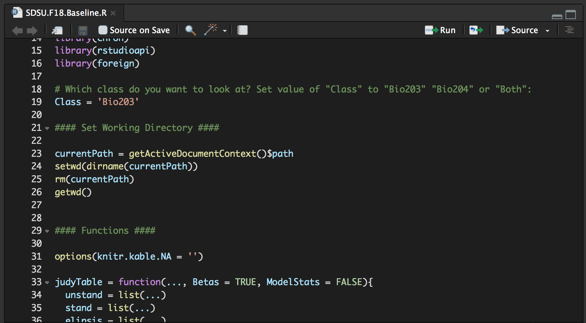

# Custom R Theme to Resemble VS Code

I like the look of Visual Studio, so with the help of [Riley Roach's](https://github.com/riley-roach/RStudio-Customizations) and [Tobias Krabel's](https://github.com/tkrabel/rstudio_atom_theme) GitHub pages I created a custom theme to make RStudio look similar. It looks like this:

## Installing the Theme

To import my custom theme, first download the `asher.rstheme` file from this repository. Save it to a place where you can find it.

In version 1.2 of RStudio it's now possible to import your own R Studio theme. To do so, go to "Preferences" -> "Appearance" and click "Add..."

Then you can select the `asher.rstheme` file that you downloaded. 

By default, R Studio will make the text for function calls the same color as variable the text for variable names. To change this, go to "Preferences" -> "Code" -> "Display" and check "Highlight R function calls." RStudio will subsequently reference the `.ace_entity.ace_name.ace_function` and `.ace_support.ace_class` parts of the rstheme document, which allows you to change the color of calls to functions and packages.

[This page](https://rstudio.github.io/rstudio-extensions/rstudio-theme-creation.html) is very helpful for outlining the different components of the rstheme code that makes up an RStudio theme.

## Changing RStudio so Surrounding Regions are Black

The updates, described above, change only the layout of the panes (e.g. the console, source, etc.). If you want to change the colors that surround the panes to further resemble VS code (which has a darker black color), [Riley Roach](https://github.com/riley-roach/RStudio-Customizations) provides the necessary instructions to do so.
